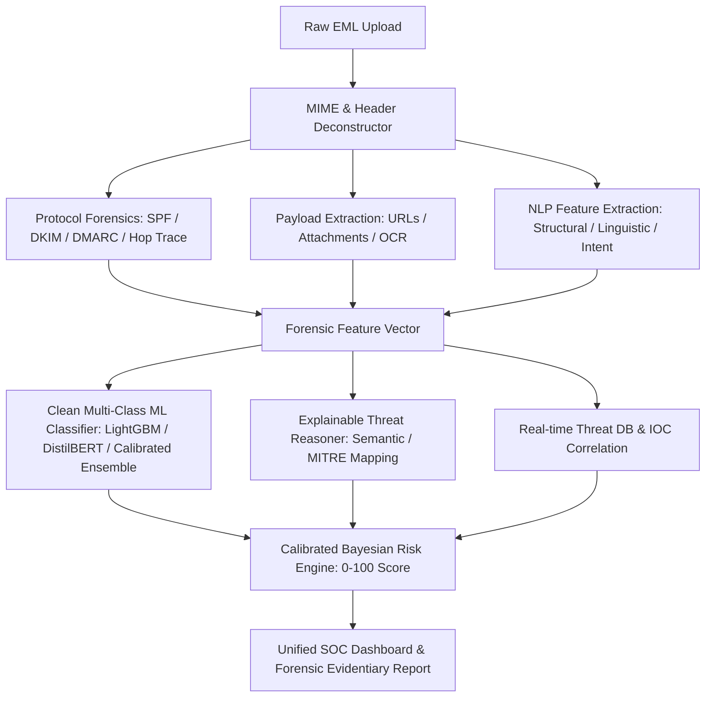

# 📊 Comprehensive Project Status & Architecture Audit
**Project:** Email Threat Intelligence & Forensics Platform  
**Audit Date:** August 2026  
**Status:** In Transition / Redesign Required  

---

## Executive Summary

The project is designed as an **End-to-End Email Threat Intelligence & Forensic Analysis Platform** that ingests raw `.eml` files, extracts forensic headers and payloads, traces network origins, executes AI/ML threat detection, and produces actionable SOC intelligence.

While the frontend UI, API structure, and basic email/header parsing are built out, **the ML/AI layer, scoring coherence, and backend pipeline suffer from severe architectural fragmentation, synthetic dataset limitations, hardcoded overrides, and conflicting heuristics.**

---

## 1. High-Level System Architecture & Component Inventory

```
email_threat_platform/
├── app/
│   ├── main.py                     # FastAPI core entrypoint, middleware, routes
│   ├── api/
│   │   ├── analyze.py              # Main /api/parse pipeline & incident reporting
│   │   └── advanced_soc.py         # MITRE ATT&CK, IOC search, playbooks endpoints
│   ├── parsers/                    # Email, header, network & OSINT parsers
│   │   ├── email_parser.py         # MIME/EML structure decoding & payload extractor
│   │   ├── auth_analysis.py        # SPF, DKIM, DMARC alignment evaluator
│   │   ├── origin_trace.py         # Received header hop-by-hop tracer
│   │   ├── geolocation.py          # MaxMind GeoLite2 IP resolver
│   │   ├── dns_intel.py            # Live DNS & MX record lookups
│   │   ├── whois_intel.py          # Domain registration & WHOIS data
│   │   └── case_db.py              # SQLite storage for past incident cases
│   ├── ml/                         # Machine Learning & AI Subsystems (⚠️ Broken/Flawed)
│   │   ├── pipeline.py             # Orchestrator for all AI/ML tasks
│   │   ├── train_model.py          # Scikit-Learn TF-IDF + Ensemble trainer
│   │   ├── threat_classifier.py    # Multi-class classifier with heuristic overrides
│   │   ├── spam_model.py           # Standalone Naive Bayes spam detector
│   │   ├── synthetic_detector.py   # Rule/entropy-based AI text generation detector
│   │   ├── bec_engine.py           # Business Email Compromise regex & logic rules
│   │   ├── feature_extractor.py    # Lexical, structural & CTA vector extractor
│   │   ├── genai_analyzer.py       # Google Gemini LLM API + deterministic fallback
│   │   ├── vector_db.py            # ChromaDB / in-memory semantic similarity
│   │   └── graph_intel.py          # Infrastructure attribution node/edge builder
│   ├── scoring/                    # Fraud scoring calculations
│   │   ├── fraud_score.py          # 0-100 composite risk scoring engine
│   │   ├── domain_check.py         # Levenshtein distance & lookalike detector
│   │   └── text_signals.py         # Urgency, manipulation & phishing CTA scan
│   └── forensics/                  # Chain of custody, report generation
├── frontend/                       # React 19 + Tailwind CSS + Lucide Icons
│   └── src/components/             # 22+ SOC & Forensic Dashboard components
└── data/                           # MaxMind DBs & storage artifacts
```

---

## 2. Why the ML/AI Subsystems Are Failing (Root Cause Analysis)

### 🔴 1. Synthetic Dataset & Poor Model Generalization
* **The Issue:** `train_model.py` trains solely on a tiny hardcoded JSON file (`synthetic_dataset.json`, ~54KB) containing ~50–100 synthetic snippets.
* **Impact:** The TF-IDF vectorizer overfits immediately to exact synthetic phrases (e.g. "urgent invoice", "password reset"). Real-world emails or variations completely miss the n-gram thresholds, producing meaningless probability distributions across the 7 threat classes.

### 🔴 2. Heuristics Overriding ML Probabilities Arbitrarily
* **The Issue:** In `threat_classifier.py`, raw ML probabilities from Scikit-Learn are converted into log-space `logits`, and then manually bombarded with hardcoded arithmetic bonuses (`+4.5`, `-3.0`, `+2.5`, etc.) based on regex hits.
* **Impact:** The machine learning model's output is effectively discarded or distorted. A single keyword regex match completely flips the prediction regardless of what the ML model learned.

### 🔴 3. Disconnected & Conflicting Models
* **The Issue:** There are two disjoint ML models operating simultaneously:
  1. `spam_model.py` (Binary Spam/Ham classifier using SMS `spam.csv`)
  2. `threat_classifier.py` (7-class threat model using `synthetic_dataset.json`)
* **Impact:** `spam_model.py` was trained on generic SMS text messages (`spam.csv`), which is fundamentally mismatched with multi-part corporate `.eml` structures, MIME bodies, and header formats.

### 🔴 4. Missing Dependencies & Vector DB Fallbacks
* **The Issue:** `chromadb`, `sentence-transformers`, `torch`, `neo4j`, and `web3` are commented out or missing in `requirements.txt` due to install weight / complexity.
* **Impact:** `vector_db.py` constantly falls back to a trivial in-memory cosine similarity loop over an empty list, meaning semantic threat matching and threat campaign clustering never work on fresh runs.

### 🔴 5. Gemini GenAI Integration Issues
* **The Issue:** `genai_analyzer.py` imports `google-genai` and expects `GEMINI_API_KEY` in the environment. When missing or rate-limited, it falls back to a static string template generator that repeats identical generic phrases.

### 🔴 6. Hardcoded Testing Hacks & Spoofs Left in Code
* **The Issue:** In `app/api/analyze.py` (lines 92–112), the IP origin geolocation is **hardcoded to spoof Bangalore, Karnataka**:
  ```python
  # Spoof suspect origin hop location to Bangalore, Karnataka
  if idx == 0 and hop.get("geolocation"):
      hop["geolocation"]["city"] = "Bangalore"
      ...
  ```
* **Impact:** True network forensic tracing is corrupted by hardcoded mock overrides.

---

## 3. Component-by-Component Status Table

| Subsystem | File / Module | Implementation Status | Functional State | Key Issues / Bottlenecks |
| :--- | :--- | :--- | :--- | :--- |
| **FastAPI Backend Core** | `app/main.py` | Complete | 🟢 Operational | Port conflicts on 8000; lifespan tasks need clean error handling. |
| **EML Parsing** | `app/parsers/email_parser.py` | Complete | 🟢 Operational | Works well for standard MIME/EML, decodes attachments & links. |
| **Auth Headers** | `app/parsers/auth_analysis.py` | Complete | 🟡 Partial | Good SPF/DKIM regex; needs more robust DMARC & ARC parsing. |
| **Origin Tracing** | `app/parsers/origin_trace.py` | Complete | 🟡 Degraded | Hardcoded Bangalore overrides in `analyze.py` bypass real output. |
| **Geolocation** | `app/parsers/geolocation.py` | Complete | 🟡 Partial | Requires valid MaxMind `.mmdb` database in `data/`. |
| **Multi-Class ML Model** | `app/ml/train_model.py` | Implemented | 🔴 Broken/Flawed | Trained on tiny synthetic dataset; zero generalization to real emails. |
| **BEC Detection Engine** | `app/ml/bec_engine.py` | Complete | 🟡 Rigid | Pure regex keyword matching; prone to false positives on legitimate VIP emails. |
| **Synthetic Text Detector** | `app/ml/synthetic_detector.py` | Complete | 🟡 Low Precision | Basic entropy & repetition metrics; inaccurate for modern LLM text. |
| **Spam Classifier** | `app/ml/spam_model.py` | Complete | 🔴 Flawed | Trained on SMS spam dataset (`spam.csv`), not email corpora. |
| **GenAI / LLM Reasoner** | `app/ml/genai_analyzer.py` | Complete | 🟡 Degraded | Depends on external API key; deterministic fallback is overly rigid. |
| **Vector DB & Matching** | `app/ml/vector_db.py` | Complete | 🟡 Mocked | Runs on in-memory fallback because ChromaDB/Transformers are disabled. |
| **Attribution Graph** | `app/ml/graph_intel.py` | Complete | 🟢 Operational | Returns structured JSON node-link data for D3/ForceGraph visualizer. |
| **Composite Fraud Score** | `app/scoring/fraud_score.py` | Complete | 🟡 Incoherent | Arithmetic weights fight against ML classifications. |
| **Frontend React UI** | `frontend/src/` | Complete | 🟢 Operational | Modern, comprehensive cyber UI with 22+ dedicated panels. |

---

## 4. Rebuild Blueprint & Roadmap

To transform this platform into a robust, high-accuracy email threat forensics system, we will rebuild the AI/ML and scoring pipelines with a clean modular architecture:



### Strategic Action Items for the Redo:

1. **Clean Dataset & Proper Model Training:**
   * Build a balanced, representative email corpus (Benign corporate, Credential Harvesting, BEC/CEO Fraud, Invoice Fraud, Extortion, Malware delivery).
   * Train a robust, calibrated Scikit-Learn / LightGBM pipeline with proper k-fold cross-validation and high F1 score across all classes.

2. **Decouple Heuristics from ML & Unify Scoring:**
   * Separate **hard protocol failures** (SPF fail, domain typo, malicious IP) from **linguistic/NLP features**.
   * Combine them using a principled calibrated Bayesian scoring matrix rather than random logit additions.

3. **Purge Mock / Spoofed Data:**
   * Remove the hardcoded Bangalore geolocation spoof in `analyze.py`.
   * Ensure origin tracing uses genuine IP resolution with fallback to internal relay detection.

4. **Streamline GenAI & Explainability:**
   * Make explainability self-contained: token attribution / SHAP n-gram extraction that works 100% offline.
   * Add seamless Gemini LLM enhancement when an API key is provided.

5. **Robust Storage & State Management:**
   * Stabilize SQLite incident storage and fast vector indexing.
