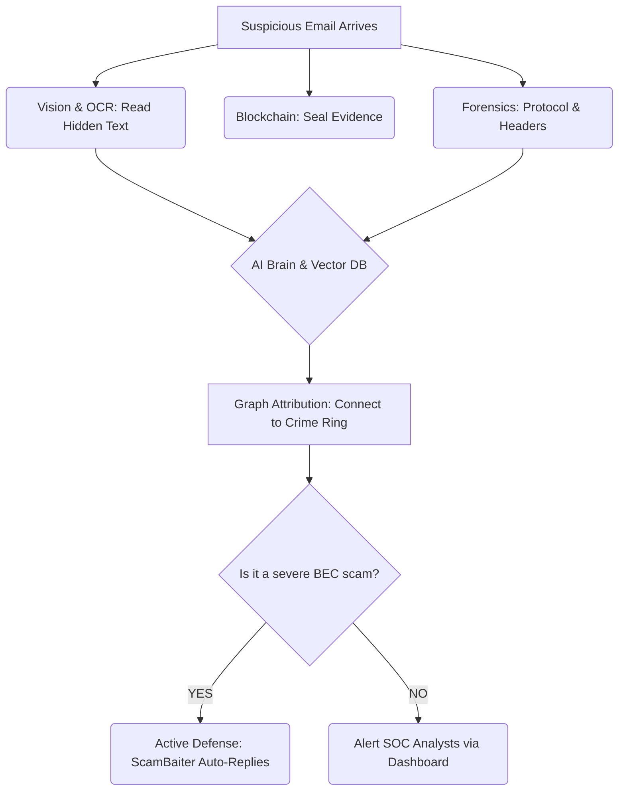

# The Complete Playbook: Email Threat Intelligence Platform

This document explains exactly how our "God Level" Email Threat Intelligence Platform works from the moment a suspicious email arrives to the moment we actively strike back at the attacker. 

It is written in plain English, complete with real-world examples and flow diagrams.

---

## 🗺 The Master Workflow (How it Works)

When a user or system forwards a suspicious `.eml` file to the platform, it triggers a massive, asynchronous investigation.

---

## 🕵️ Step-by-Step Investigation Walkthrough

### Step 1: "The Cryptographic Seal" (Blockchain Notary)
*   **What it does:** Before we even look at the email, we mathematically lock it. We take the raw code of the email and generate a SHA-256 hash, pushing it to a Blockchain ledger.
*   **Why it matters:** If this case goes to trial or an insurance claim, the defense lawyer will say, "You altered this email to frame my client." We can point to the blockchain and prove mathematically it has never been touched.
*   **Example:** John receives an email from "HR" asking for his W2. The platform instantly seals the evidence before John even clicks it.

### Step 2: "The X-Ray" (Advanced Vision & OCR)
*   **What it does:** Scammers know we scan text, so they take a screenshot of their phishing message and attach it as an image or PDF. Our Computer Vision engine (Tesseract OCR) reads images exactly like a human does. It also detonates QR codes.
*   **Example:** The email has no text, just an image that says: *"Your password expired. Scan this QR code on your phone."* Our platform reads the image, extracts the malicious link from the QR code, and flags it.

### Step 3: "Breaking the VPN" (Speed-of-Light Triangulation)
*   **What it does:** We read the "postmarks" (Received headers) to track every server the email touched. Scammers use VPNs to fake their location. We use the speed of light to catch them in a lie.
*   **Example:** 
    *   Hop 1 (Attacker's Server): Claims to be in **Moscow, Russia**.
    *   Hop 2 (Forwarding Server): Claims to be in **New York, USA**.
    *   *Our Platform notices the time difference between Hop 1 and Hop 2 was only **0.005 seconds**.*
    *   **Verdict:** Data cannot cross the Atlantic Ocean in 5 milliseconds. The attacker is lying about their location and is likely using a local proxy.

### Step 4: "The Polygraph" (Stylometry & NLP)
*   **What it does:** The AI analyzes the emotional tone and vocabulary of the email. It looks for urgency, authority impersonation, and mismatched URLs.
*   **Example:** An email arrives from `CEO@company.com` saying: *"I am in a meeting. Wire $50k to this vendor now."* The AI flags this because (A) the CEO never uses the word "vendor" in past emails, and (B) the domain is actually `company.c0m` (with a zero).

### Step 5: "The String Board" (Semantic Memory & Graph DB)
*   **What it does:** Detectives use string boards to connect suspects. We use a **Neo4j Graph Database** and a **Chroma Vector DB**. Even if the attacker changes their name, email, and IP address, the mathematical "shape" of their email text will match a past crime.
*   **Example:** "Attacker A" sends a fake invoice from Nigeria. A month later, "Attacker B" sends a fake invoice from Brazil. Our Vector Database realizes the sentences are 99% mathematically identical. Our Graph Database merges them into a single organized crime ring campaign.

---

## ⚔️ Step 6: Active Defense (The ScamBaiter)
*This is where the platform goes from a shield to a weapon.*

If the platform decides an email is a highly confident, manual scam (like Business Email Compromise), it does not just block it. It routes the email to our **Kafka Event Bus**, which wakes up the **ScamBaiter Agent**.

**How the ScamBaiter fights back:**
1.  **Wastes Time:** An LLM generates a highly realistic, confused reply. 
    *   *ScamBaiter Reply:* "Hi, I tried to pay this invoice but our portal says the routing number is invalid. Can you provide an alternative SWIFT code?"
2.  **Drops a Tracker:** Hidden inside the reply is an invisible 1x1 tracking pixel.
3.  **Deanonymizes the Attacker:** When the greedy scammer opens the email on their personal phone to reply, the tracking pixel fires, capturing their *real* IP address, device type, and location, feeding it straight back to our investigators.

---

## 🏢 The Enterprise Infrastructure

To process millions of emails a day without crashing, the platform runs on a modern, decoupled microservices architecture via Docker:

1.  **FastAPI:** The brain that orchestrates the scans.
2.  **React Dashboard:** The beautiful glass-pane window for the security analysts to view the crime maps.
3.  **Apache Kafka:** The central nervous system. When an email arrives, Kafka yells "New Email!" and 10 different microservices (Vision, Blockchain, Geolocation) grab it and process it simultaneously.
4.  **Neo4j & Postgres:** The heavy-duty databases that store the complex webs of threat actor data.
